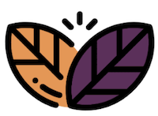

# Foodie 
helping you live a healthier life

### Product
Foodie is a hackathon project built to tackle malnutrition in urbanized areas and food deserts. We have built out a full stack product that uses image recognition and classification to scan vegetables and groceries, automatically search healthy and affortable recipes that include these foods as ingredients. The goal of this product is to make it easy for users to search out new and healthy meals. 

### Tools used 
- Python Flask backend 
- IBM watson image recognition
- Edemam Recipe API  
- Angular 8 frontend

###  Team
This team (not Sam Larsen) participated in the 2017 Summer Internship for Optum (`NC021`) and have stayed connected since! As a group, we are continuining trying to learn and leverage fun technologies to do our life's best work.

Name | Bitmoji | Role | Optum Internal Team
------------ | ------------- | ------------- | -------------
Jay Park| | Software Engineer | Jetson
Sam Crochet | | Software Engineer Intern | WildFhir
Sam Larsen |  | Software Engineer Intern | WildFhir

 
